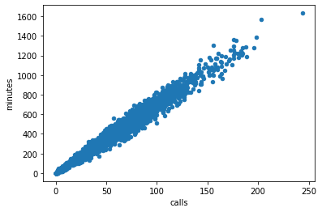

<div style="background: #cceeaa; padding: 5px; border: 1px solid green; border-radius: 5px;">
    <font color='green'> <b><u>КОММЕНТАРИЙ РЕВЬЮЕРА</u></b>

Георгий, доброго дня! рад приветствовать тебя) <br />
<br />
Меня зовут Николай Шавлюго. <br />И на этом этапе твоего движения к новой профессии от меня будут комментарии по написанному коду. <br />Чтобы меньше "мусорить эфир" и чтобы максимально наглядно отделяться от основного кода, есть предложение условиться в некоторых обозначениях:<br /> <br />
<u><b>ТАКОЙ ШРИФТ</b></u> - всегда начало комментария <br />
<font color='green'>такой шрифт</font> - комментарии о том, что всё ОК <br/>
<font color='orange'>такой шрифт</font> - комментарии о том, что всё ОК по результату,<br> однако есть на что обратить внимание в плане применения техник, или есть способы сделать более короткий или быстрый код <br/>
<font color='red'>такой шрифт</font> - комментарии о том, что есть критичный момент, влияющий на бизнес-результат проекта.<br/>
</font><br /><br />
<font color='green'>Моей целью является не "уличить" в не знании, а просто высказать сверху твоих знаний - свой опыт, что бы ты мог использовать его для своего дальнейшего успеха) И очень здорово будет, если тебе удастся задавать вопросы, да и вообще - всячески доставать меня, если я по каким-то причинам не приму проект:) При этом, из своего опыта скажу, хорошо и важно, когда переписка ревьюера и студента - сохраняется на следующие проекты и даже на будущую практическую деятельность.<br>
<br> Я сразу же начал общаться на ты:) но если это не очень удобно, то дай знать)) <BR> В ПУТЬ!<br>

# Рекомендация тарифов

В вашем распоряжении данные о поведении клиентов, которые уже перешли на эти тарифы (из проекта курса «Статистический анализ данных»). Нужно построить модель для задачи классификации, которая выберет подходящий тариф. Предобработка данных не понадобится — вы её уже сделали.

Постройте модель с максимально большим значением *accuracy*. Чтобы сдать проект успешно, нужно довести долю правильных ответов по крайней мере до 0.75. Проверьте *accuracy* на тестовой выборке самостоятельно.

## Откройте и изучите файл


```python
import pandas as pd
from sklearn.tree import DecisionTreeClassifier
from sklearn.ensemble import RandomForestClassifier
from sklearn.linear_model import LogisticRegression
from sklearn.model_selection import train_test_split
from sklearn.metrics import mean_squared_error
from sklearn.metrics import accuracy_score
from sklearn.dummy import DummyClassifier
```


```python
df = pd.read_csv('/datasets/users_behavior.csv')
df
```


<div>
<style scoped>
    .dataframe tbody tr th:only-of-type {
        vertical-align: middle;
    }

    .dataframe tbody tr th {
        vertical-align: top;
    }

    .dataframe thead th {
        text-align: right;
    }
</style>
<table border="1" class="dataframe">
  <thead>
    <tr style="text-align: right;">
      <th></th>
      <th>calls</th>
      <th>minutes</th>
      <th>messages</th>
      <th>mb_used</th>
      <th>is_ultra</th>
    </tr>
  </thead>
  <tbody>
    <tr>
      <td>0</td>
      <td>40.0</td>
      <td>311.90</td>
      <td>83.0</td>
      <td>19915.42</td>
      <td>0</td>
    </tr>
    <tr>
      <td>1</td>
      <td>85.0</td>
      <td>516.75</td>
      <td>56.0</td>
      <td>22696.96</td>
      <td>0</td>
    </tr>
    <tr>
      <td>2</td>
      <td>77.0</td>
      <td>467.66</td>
      <td>86.0</td>
      <td>21060.45</td>
      <td>0</td>
    </tr>
    <tr>
      <td>3</td>
      <td>106.0</td>
      <td>745.53</td>
      <td>81.0</td>
      <td>8437.39</td>
      <td>1</td>
    </tr>
    <tr>
      <td>4</td>
      <td>66.0</td>
      <td>418.74</td>
      <td>1.0</td>
      <td>14502.75</td>
      <td>0</td>
    </tr>
    <tr>
      <td>...</td>
      <td>...</td>
      <td>...</td>
      <td>...</td>
      <td>...</td>
      <td>...</td>
    </tr>
    <tr>
      <td>3209</td>
      <td>122.0</td>
      <td>910.98</td>
      <td>20.0</td>
      <td>35124.90</td>
      <td>1</td>
    </tr>
    <tr>
      <td>3210</td>
      <td>25.0</td>
      <td>190.36</td>
      <td>0.0</td>
      <td>3275.61</td>
      <td>0</td>
    </tr>
    <tr>
      <td>3211</td>
      <td>97.0</td>
      <td>634.44</td>
      <td>70.0</td>
      <td>13974.06</td>
      <td>0</td>
    </tr>
    <tr>
      <td>3212</td>
      <td>64.0</td>
      <td>462.32</td>
      <td>90.0</td>
      <td>31239.78</td>
      <td>0</td>
    </tr>
    <tr>
      <td>3213</td>
      <td>80.0</td>
      <td>566.09</td>
      <td>6.0</td>
      <td>29480.52</td>
      <td>1</td>
    </tr>
  </tbody>
</table>
<p>3214 rows × 5 columns</p>
</div>


```python
print(df['calls'].corr(df['minutes']))
```

    0.9820832355742293


```python
df.plot(x='calls', y='minutes', kind='scatter')
```


    <matplotlib.axes._subplots.AxesSubplot at 0x7f99764179d0>


    

    


<div style="background: #cceeaa; padding: 5px; border: 1px solid green; border-radius: 5px;">
<font color='green'> 
    <b><u>КОММЕНТАРИЙ РЕВЬЮЕРА</u></b>
<font color='green'><br>
ОК, данные загружены.<br>
В этом проекте отрабатывается навык построения предсказательных моделей. И не требуется уделять много времени предобработке данных (пропуски, дубликаты), верно. Но вот провести анализ факторов, которые буду входить в модель было бы не плохо.

Скажем, если есть мультиколлинеаорность факторов (когда факторы модели имеют сильную связь друг с другом), то сразу можно один из факторов исключить.<br>

<font color='red'>
Попробуй сделать некоторые аналитические "раскопки" по мультиколлинеарности факторов)<br>

<div class="alert alert-info"> <b>Комментарий студента:</b> Всё равно не совсем понимаю что конкретно нужно сделать. Подскажи пожалуйста</div>

<div style="background: #cceeaa; padding: 5px; border: 1px solid green; border-radius: 5px;">
<font color='green'><u><b>КОММЕНТАРИЙ РЕВЬЮЕРА 2</b></u></font><br />
<font color='green'><br>
Привет, Георгий.<br>
По мультиколлинеарности в целом:<br>
Тут два аспекта можно рассматривать:<br>
1) математический: когда два фактора имеют сильную корреляцию, то при матричных вычислениях внутри некоторых методов наступаю сложности. И самим методам внутри прихрдится их решать. Это может давать некторые неточности в расчётах. Плюс - скорость расчётов снижается.<br>
2) бизнесово-логичесвкая: если два фактора очень сильно связаны друг с другом, то значит они имеют примерно одинаковое влияние на целевую переменную. А значит какой смысл оба их держать в модели. Напрмиер, каким-то образом попадутся факторы скорости, измеренные в км/ч и м/с - тут всем ясно (и бизнесу в том числе), что один фактор - излишний.<br>Если факторы имеют высокую корреляцию, НО логически НИКАК не связы друг с другом, то надо поисследолвать ещё, прежде чем удалять)<br>
    
Чтобы увидеть всю матрицу корреляций , можно использовать df.corr(). Только использовать её лучше исключитеьно для количественных шкал. (т.е. все кроме is_ultra - она в бинарной шкале - 0 и 1 )<br>
    
Из таблички выделяем пары фактров, которые имеют корреляцию более 0.9 И тогда один из них = можно убрать.<br>
В нашем случае есть пара минуты/звонки.<br>
Мне удалось ответить? или осталимь ещё вопросы)

<div class="alert alert-info"> <b>Комментарий студента:</b> Понял!) В таком случае можно убрать столбец calls. </div>

<div style="background: #cceeaa; padding: 5px; border: 1px solid green; border-radius: 5px;">
<font color='green'> 
    <b><u>КОММЕНТАРИЙ РЕВЬЮЕРА 3</u></b>
<font color='green'><br>ОК, Георгий. Тогда, вроде, всё)<br>
УСПЕШНОГО ДАЛЬНЕЙШЕГО ОБУЧЕНИЯ!


```python

```


```python
df = df.drop('calls', 1)
```


```python
df
```


<div>
<style scoped>
    .dataframe tbody tr th:only-of-type {
        vertical-align: middle;
    }

    .dataframe tbody tr th {
        vertical-align: top;
    }

    .dataframe thead th {
        text-align: right;
    }
</style>
<table border="1" class="dataframe">
  <thead>
    <tr style="text-align: right;">
      <th></th>
      <th>minutes</th>
      <th>messages</th>
      <th>mb_used</th>
      <th>is_ultra</th>
    </tr>
  </thead>
  <tbody>
    <tr>
      <td>0</td>
      <td>311.90</td>
      <td>83.0</td>
      <td>19915.42</td>
      <td>0</td>
    </tr>
    <tr>
      <td>1</td>
      <td>516.75</td>
      <td>56.0</td>
      <td>22696.96</td>
      <td>0</td>
    </tr>
    <tr>
      <td>2</td>
      <td>467.66</td>
      <td>86.0</td>
      <td>21060.45</td>
      <td>0</td>
    </tr>
    <tr>
      <td>3</td>
      <td>745.53</td>
      <td>81.0</td>
      <td>8437.39</td>
      <td>1</td>
    </tr>
    <tr>
      <td>4</td>
      <td>418.74</td>
      <td>1.0</td>
      <td>14502.75</td>
      <td>0</td>
    </tr>
    <tr>
      <td>...</td>
      <td>...</td>
      <td>...</td>
      <td>...</td>
      <td>...</td>
    </tr>
    <tr>
      <td>3209</td>
      <td>910.98</td>
      <td>20.0</td>
      <td>35124.90</td>
      <td>1</td>
    </tr>
    <tr>
      <td>3210</td>
      <td>190.36</td>
      <td>0.0</td>
      <td>3275.61</td>
      <td>0</td>
    </tr>
    <tr>
      <td>3211</td>
      <td>634.44</td>
      <td>70.0</td>
      <td>13974.06</td>
      <td>0</td>
    </tr>
    <tr>
      <td>3212</td>
      <td>462.32</td>
      <td>90.0</td>
      <td>31239.78</td>
      <td>0</td>
    </tr>
    <tr>
      <td>3213</td>
      <td>566.09</td>
      <td>6.0</td>
      <td>29480.52</td>
      <td>1</td>
    </tr>
  </tbody>
</table>
<p>3214 rows × 4 columns</p>
</div>


## Разбейте данные на выборки


```python
features = df.drop(['is_ultra'], axis=1)
target = df['is_ultra']
```


```python
features_train, features_valid, target_train, target_valid = train_test_split(features, target, test_size=0.4, random_state=12345)
features_valid, features_test, target_valid, target_test = train_test_split(features_valid, target_valid, test_size=0.5, random_state=12345)
```


```python
print(features_train.shape)
print(target_train.shape)

print(features_valid.shape)
print(target_valid.shape)

print(features_test.shape)
print(target_test.shape)
```

    (1928, 3)
    (1928,)
    (643, 3)
    (643,)
    (643, 3)
    (643,)


Разбили данные на признак и цель. Затем разбили еще на 6 выборок: 2 обучающие, 2 валидационные и 2 тестовые

<div style="background: #ffeeaa; padding: 5px; border: 1px solid green; border-radius: 5px;">
<font color='green'> 
    <b><u>КОММЕНТАРИЙ РЕВЬЮЕРА</u></b>
<font color='green'><br>
ОК, хорошо, здесь можно ещё проконтролировать размер новых выборок. Например командой shape

<div class="alert alert-info"> <b>Комментарий студента:</b> Вывел выборки. Если сложить значения, то получится пропорция 6:2:2 </div>


## Исследуйте модели

**Дерево решений - Decision Tree**


```python
best_model_dt = None
best_result_dt = 0
best_depth = 0
for depth in range(1, 101):
    model = DecisionTreeClassifier(random_state=12345, max_depth=depth)
    model.fit(features_train, target_train)
    predictions_valid = model.predict(features_valid)
    result = accuracy_score(predictions_valid, target_valid)
    if result > best_result_dt:
        best_result_dt = result
        best_model_dt = model
        best_depth = depth
```


```python
print(f'Лучшая accuracy у модели решающего дерева равна {best_result_dt}, глубина деревьев: {best_depth}')
```

    Лучшая accuracy у модели решающего дерева равна 0.7884914463452566, глубина деревьев: 4


<div style="background: #cceeaa; padding: 5px; border: 1px solid green; border-radius: 5px;">
<font color='green'> 
    <b><u>КОММЕНТАРИЙ РЕВЬЮЕРА</u></b>
</font><br>
<font color='green'>
Вот она - первая модель!)

**Случайный лес - Random Forest**


```python
best_model_rt = None
best_result_rt = 0
best_est = 0
for est in range(1, 101):
    model = RandomForestClassifier(random_state=12345, n_estimators=est)
    model.fit(features_train, target_train)
    predictions_valid = model.predict(features_valid)
    result = accuracy_score(predictions_valid, target_valid)
    if result > best_result_rt:
        best_result_rt = result
        best_model_rt = model
        best_est = est
```


```python
print(f'Лучшая accuracy у модели случайного дерева равна {best_result_rt}, Колличество деревьев: {best_est}')
```

    Лучшая accuracy у модели случайного дерева равна 0.7822706065318819, Колличество деревьев: 18


**Логическая регрессия**


```python
model_lr = LogisticRegression(random_state=12345)
model_lr.fit(features_train, target_train)
predictions = model_lr.predict(features_valid)
result = accuracy_score(target_valid, predictions)
print(result)
```

    0.7076205287713841


    /opt/conda/lib/python3.7/site-packages/sklearn/linear_model/logistic.py:432: FutureWarning: Default solver will be changed to 'lbfgs' in 0.22. Specify a solver to silence this warning.
      FutureWarning)


Я сделал несколько моделей и сравнил между собой. Самая лучшая точность у модели Random Forest

<div style="background: #cceeaa; padding: 5px; border: 1px solid green; border-radius: 5px;">
<font color='green'> 
    <b><u>КОММЕНТАРИЙ РЕВЬЮЕРА</u></b>
</font><br>
<font color='green'>    
В целом - ОК. Есть модельное начало!<br>    
<font color='red'>
А вот линейная регрессия тут не подойдёт( Дело в том, что наша целевая - бинарная. Т.е. мы решаем модель классификации. А линейная регрессия - для случаев, когда целевая - количественная шкала.

<div class="alert alert-info"> <b>Комментарий студента:</b> Удалил линейную регрессию </div>

<div style="background: #cceeaa; padding: 5px; border: 1px solid green; border-radius: 5px;">
<font color='green'> 
    <b><u>КОММЕНТАРИЙ РЕВЬЮЕРА 2</u></b>
<font color='green'><br>
ОК

## Проверьте модель на тестовой выборке

Возьмём лучшую модель (в нашем случае Random Tree) и сделаем предсказание


```python
predictions = best_model_rt.predict(features_test)
result = accuracy_score(target_test, predictions)
print(result)
```

    0.7853810264385692


<div style="background: #cceeaa; padding: 5px; border: 1px solid green; border-radius: 5px;">
<font color='green'> 
    <b><u>КОММЕНТАРИЙ РЕВЬЮЕРА</u></b>
</font><br>
<font color='green'><br>ОК, Георгий, хорошая модельная работа на этом спринте, уверенное движение)<br>
Оценил данные для модели, провел разносторннюю модельную работу с перебором параметров - ничего не забыто <br>
Метрики рассчитаны и выведены понятно и логично. Что ещё надо ревьеру для полного счастья))<br>
И видно, что проделана рабочая аналитическая работа.<br><br>
    
Этот проект - только начало моделирования. Дальше, конечно же, информация и скилы будут нарастать. <br>
Попробую изложить своё видение поиска моедли для прогнозирования чего-либо.<br>
Нучну с того, то у нас (у модели) есть цель: максимально точно описать поведение изучаемого процесса(объекта), чтобы предсказать его (объекта) поведение в будущем.<br> например поведение клиента или продажи в четверг на следующей неделе.<br>
Описать поведение можно с помощью математической формулы.<br>
И всё искусство аналитика - создать такую формулу-модель.<br>
На точность поиска формулы влияют три группы причин:<br>
1) тип модели: ты их как раз и перебираешь. Заранее не всегда можно сказать какая модель именно для конкретных данных подходит. Нужно пробовать, анализировать.<br>
2) гиперпараметры модели: =По умолчанию их выставляют оптимальными (в моделях их может быть десятки). И некоторые вот надо подбирать пребором -стараться улучшит. Причём границы - не известны. Понятно только, что надо стараться, чтобы их было меньше. Как в технике: чем проще изделие - тем меньше ломается) Чем проще модель, тем понянее.<br> Хотя сейчас новая эра настала: На одной из лекций DS-гуру я услышал как-то такие слова: "а не важно, как машина подобрала параметры, важно что она не ошиблась" :).<br>
3) Внешние факторы для моделей: это то, что звонки, минуты.... С этим понятно. 
    
Вот, три группы возможностей создать хорошую модель. И каждым из них надо владеть DS-специалисту. В этом проекте, одна из целей - первичное знакомство с возможностями гиперпараметров.<br><br>
 
Если возвращаться к проекту ещё, то момент зафиксировал бы, чтобы будущие работы можно было ещё улучшить:<br>
Более глубокое предварительное исследование факторов: основная цель: понять философию факторов, которые мы хотим использовать для моделирования. Предварительная аналитика сможет улучшить модель и сделать её более устойчивой. Например, минуты и зывонки - мультиколлинеарны. <br><br>
    
<font color='red'>
Что ещё лучше сделать в этой работе:<br>    
Добавь, пожалуйста, корреляционный анализ факторов (найти корреляции между числовыми факторами и построить график скатерплот), чтобы выявить мультиколлинеарность факторови и принять решение о включении в модель<br>
    
Ну и с линейной регрессией - посмотри, пожалуйста)<br>
<font color='green'>   
<br>Спасибо)<br>Буду ждать.

<div class="alert alert-info"> <b>Комментарий студента:</b> Исследовал мультиколлинеарность. Построил скаттерплот. Удалил столбец 'calls' </div>


```python

```

## (бонус) Проверьте модели на адекватность

Проверка Decision Tree


```python
predictions_valid = best_model_dt.predict(features_valid)
result = mean_squared_error(target_valid, predictions_valid)**0.5
print(result)
```

    0.45990059105717984


Проверка Random Forest


```python
predictions_valid = best_model_rt.predict(features_valid)
result = mean_squared_error(target_valid, predictions_valid)**0.5
print(result)
```

    0.46661482345519006


Не совсем понимаю что значит проверить на адекватность

<div style="background: #cceeaa; padding: 5px; border: 1px solid green; border-radius: 5px;">
<font color='green'> 
    <b><u>КОММЕНТАРИЙ РЕВЬЮЕРА</u></b>
</font><br>
<font color='green'><br>
Тут такое имеется ввиду.<br>
Под адекватностью можно понимать ещё и так: наша модель лучше для бизнеса, чем вообще без модели? <br>
Т.е. СТоит вкладываться в DS или можно позвать "деда Васю" и он так, на глаз...<br>
Когда модель прогнозирует колличественный параметр, например продажи в штуках, то модель сравнивают со средними продажами. Типа в среднем у нас продажи столько-то единиц товара будет завтра. Ну и сравнивают с предсказанием модели.<br>
Когда модель предсказывает количесвто угадывания, как в данном проекте, то считают просто количество по выборке<br>
    
Ну вот например такая команда<br>
df['is_ultra'].value_counts() / df.shape[0]<br>
    
покажет какая будет точность наличия 0.<br>
И тут идёт сравнение: если точность модели > вот этой константной (нулевой), то значит модель лучше предсказывает и она адекватна для использования<br><br>
    
  
Можно ещё вот эту команду использовать. В нашем случае ИМЕННО most_frequent подойдёт лучше всего)<br><br>   
    
strategies = ['most_frequent'] <br>
  
dummy_results = [] <br>
for strategy in strategies: <br>
    dc = DummyClassifier(strategy = strategy, random_state = 42)<br>
    
    dc.fit(features_train, target_train) <br>
    result = dc.score(features_test, target_test) <br>
    dummy_results.append({strategy: result}) <br>

pd.DataFrame(dummy_results)    <br>


```python
df['is_ultra'].value_counts() / df.shape[0]
```


    0    0.693528
    1    0.306472
    Name: is_ultra, dtype: float64


```python
strategies = ['most_frequent']

dummy_results = []
for strategy in strategies:
    dc = DummyClassifier(strategy = strategy, random_state = 12345)

    dc.fit(features_train, target_train)
    result = dc.score(features_test, target_test)
    
    dummy_results.append({strategy: result})
pd.DataFrame(dummy_results)
dummy_results
```


    [{'most_frequent': 0.6842923794712286}]


<div class="alert alert-info"> <b>Комментарий студента:</b> Не совсем понимаю, что делает функция DummyClassifier. Ох чувствую надо подтягивать английский для программирования, чтобы точнее понимать документацию) </div>

<div style="background: #cceeaa; padding: 5px; border: 1px solid green; border-radius: 5px;">
<font color='green'> 
    <b><u>КОММЕНТАРИЙ РЕВЬЮЕРА 3</u></b>
<font color='green'><br>
По сути и без неё можно. В предыдущ5м комментарии - там решегние есть просто подсчётом: df['is_ultra'].value_counts() / df.shape[0]<br>

## Чек-лист готовности проекта

Поставьте 'x' в выполненных пунктах. Далее нажмите Shift+Enter.

- [x] Jupyter Notebook открыт
- [ ] Весь код исполняется без ошибок
- [ ] Ячейки с кодом расположены в порядке исполнения
- [ ] Выполнено задание 1: данные загружены и изучены
- [ ] Выполнено задание 2: данные разбиты на три выборки
- [ ] Выполнено задание 3: проведено исследование моделей
    - [ ] Рассмотрено больше одной модели
    - [ ] Рассмотрено хотя бы 3 значения гипепараметров для какой-нибудь модели
    - [ ] Написаны выводы по результатам исследования
- [ ] Выполнено задание 4: Проведено тестирование
- [ ] Удалось достичь accuracy не меньше 0.75


```python

```
